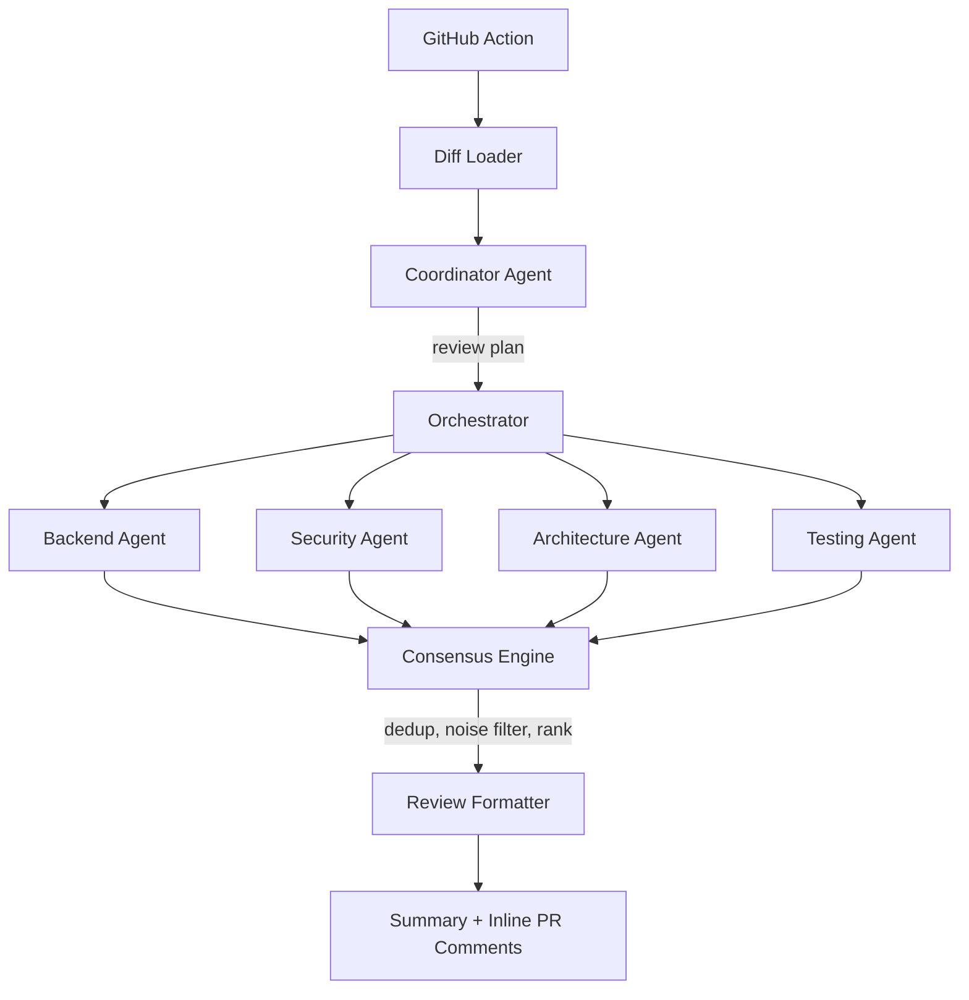

# asyncs

Open-source sub-agent driven AI PR review harness.

Instead of one generic AI reviewer, asyncs reviews pull requests like a team. A coordinator agent reads the diff and plans the review, specialist agents (backend, security, architecture, testing, and more) run in parallel on their own slices, and a consensus layer merges their findings, drops duplicates, and filters out noise before anything reaches your PR.

The result: a summary comment plus inline comments anchored to the exact changed lines — only where something actually matters.

## How it works



Every finding ships with evidence and a recommendation, or it does not ship at all.

## Quick start: review every PR with the GitHub Action

Add one workflow file and one secret:

```yaml
name: asyncs review

on:
  pull_request:
    types: [opened, synchronize, reopened]

permissions:
  contents: read
  pull-requests: write

jobs:
  review:
    runs-on: ubuntu-latest
    steps:
      - uses: actions/checkout@v4
        with:
          fetch-depth: 0
      - uses: alex-bar25/asyncs/apps/action@v1
        with:
          anthropic-api-key: ${{ secrets.ANTHROPIC_API_KEY }}
          mode: low-noise
          agents: backend,security,architecture,testing
```

Set `ANTHROPIC_API_KEY` in the repository secrets and asyncs reviews every PR from then on.

### Action inputs

| Input               | Required | Default        | Description                                                                                  |
| ------------------- | -------- | -------------- | -------------------------------------------------------------------------------------------- |
| `anthropic-api-key` | yes      | —              | Anthropic API key used by the review agents.                                                 |
| `github-token`      | no       | `github.token` | Token used to post review comments.                                                          |
| `model`             | no       | asyncs default | Model id override.                                                                           |
| `mode`              | no       | `low-noise`    | Review mode: `low-noise`, `full`, `security`, `architecture`, or `testing`.                  |
| `agents`            | no       | mode-based     | Comma-separated agent kinds to run, overriding mode-based routing (e.g. `backend,security`). |

### What gets posted

- One summary comment per PR, updated in place on every push.
- One inline comment per finding, anchored to the changed file and line, recreated on every run so they always match the latest review.
- Findings that cannot be anchored to the diff stay in the summary.

## Architecture

| Package                  | Responsibility                                                             |
| ------------------------ | -------------------------------------------------------------------------- |
| `packages/core`          | Domain types, constants, zod schemas, type guards                          |
| `packages/agents`        | Built-in specialist agents, coordinator prompts, structured output schemas |
| `packages/orchestration` | Review planning, parallel execution, retries, timeouts, pipeline engine    |
| `packages/routing`       | Mode-based agent defaults and explicit overrides                           |
| `packages/consensus`     | Deduplication, noise filtering, severity and confidence ranking            |
| `packages/providers`     | Provider interface plus the Anthropic implementation                       |
| `packages/formatter`     | Markdown review rendering                                                  |
| `packages/diff`          | Local git diff loading: working tree, staged, commit range                 |
| `apps/action`            | GitHub Action: event parsing, review run, comment posting                  |

Design specs and implementation plans live in [docs/superpowers/specs](docs/superpowers/specs) and [docs/superpowers/plans](docs/superpowers/plans).

## Development

```bash
bun install
bun run check   # typecheck + lint + format check + tests
```

## Principles

- Evidence-based findings only: every comment carries evidence and a recommendation.
- Low noise by default: one strong comment beats five weak ones.
- Provider agnostic: vendor-specific code stays behind a small provider interface.
- Hackable and open source: the engine is a library; the Action is a thin shell around it.
